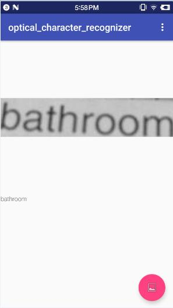

# How to build the demo

- Prepare the PaddlePaddle libraries for Android, and put it to the current position:

  ```text
  PaddleNativeDemo/android $ tree
  .
  ├── image_classification
  ├── optical_character_recognization
  ├── paddle
  │   ├── include
  │   ├── lib
  │   │   ├── arm64-v8a
  │   │   └── armeabi-v7a
  │   └── third_party
  │       ├── gflags
  │       ├── glog
  │       ├── openblas
  │       ├── protobuf
  │       └── zlib
  └── utils
  ```

- Put the model `eng_reg_96_trans.paddle` to `optical_character_recognization/src/main/assets`
- Open the project using Android Studio, then you can build and run the demo.

- Result

  
